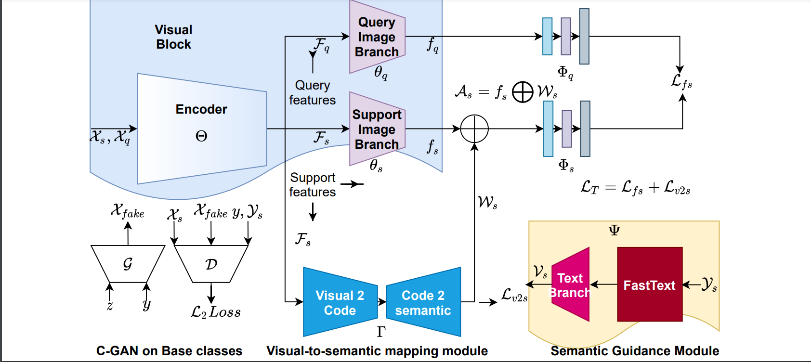

# SemGIF: A Semantics Guided Incremental Few-shot Learning Framework with Generative Replay

Official implementation of [[SemGIF](https://www.bmvc2021-virtualconference.com/assets/papers/0673.pdf)].


<p align='center'>
    
</p>


## Description

We address the problem of incremental few-shot learning (IFSL) by leveraging the notion of generative feature replay. Learning novel concepts while preserving old knowledge is a long-lasting challenge in machine learning. The main concern in IFSL is to combat the catastrophic forgetting of the base classes whose training data are not available during the incremental stage while ensuring good generalization for the few-shot classes. Existing techniques prefer to preserve some base class samples to tackle forgetting, which does not comply with the intention of incremental learning. To this end, we propose a novel framework called Semantics Guided IFSL (SemGIF), which trains a generative model to synthesize base class samples on demand during the incremental step. Considering the importance of modeling a discriminative feature space in IFSL for separating the base and the novel classes, we propose a feature augmentation strategy where the visual embeddings are supplemented with the semantic features obtained from a word-embedding space. Such a feature space is found to produce enriched class prototypes to be utilized during classification. Experimental results on CIFAR-100, CUB, mini-ImageNet, and tiered-ImageNet in the homogeneous (within-dataset) and a novel heterogeneous (cross-dataset) setup showcase sharp improvements than the literature.

The complete paper can be found here: https://www.bmvc2021-virtualconference.com/conference/papers/paper_0673.html

## Getting Started

### Dependencies

* python3
* torchmeta
* gensim
* pytorch

### Installing

* For information on the installation  and usage of the torchmeta library visit: https://github.com/tristandeleu/pytorch-meta

<!--### Executing program

* To run the main 
* Step-by-step bullets
```
code blocks for commands
```-->

## Authors

S Divakar Bhat, Biplab Banerjee, Subhasis Chaudhuri


## Citation
> S Divakar Bhat, Biplab Banerjee and Subhasis Chaudhuri. SemGIF: A Semantics Guided Incremental Few-shot Learning Framework with Generative Replay, The 32nd British Machine Vision Conference 2021, [[bmvc2021](https://www.bmvc2021-virtualconference.com/assets/papers/0673.pdf)]

If you want to cite, use the following Bibtex entry:
```
@inproceedings{sdbhatsemgif,
  title={SemGIF: A Semantics Guided Incremental Few-shot Learning Framework with Generative Replay},
  author={Bhat, S Divakar and Banerjee, Biplab and Chaudhuri, Subhasis},
  booktitle={BMVC},
  pages={},
  year={2021}
}
```
